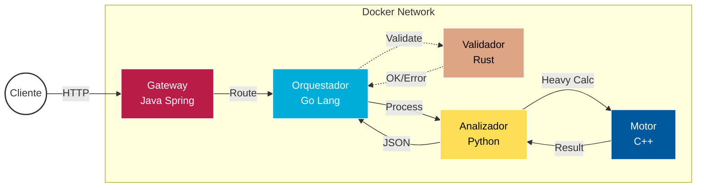

# 🚀 Sistema Multilenguaje - Microservicios Distribuidos


[](https://openjdk.java.net/)
[](https://golang.org/)
[](https://python.org/)
[](https://rust-lang.org/)
[](https://isocpp.org/)
[](https://docker.com/)

[]
[]
[]
[]

## 📋 Descripción

Sistema distribuido de microservicios que integra **5 lenguajes de programación** diferentes, cada uno optimizado para tareas específicas. Demuestra una arquitectura profesional de nivel empresarial con comunicación HTTP entre servicios.

## 🏗️ Arquitectura del Sistema



### 🎯 Propósito de cada Servicio

| Servicio | Lenguaje | Puerto | Función Principal |
|----------|----------|--------|-------------------|
| **API Gateway** | Java Spring Boot | 8081 | Punto de entrada, enrutamiento |
| **Orquestador** | Go + Gorilla Mux | 8082 | Coordinación de servicios |
| **Validador** | Rust + Actix Web | 8084 | Seguridad y validación |
| **Analizador** | Python + FastAPI | 8083 | Procesamiento de datos |
| **Motor** | C++ + httplib | 8085 | Cálculos de alto rendimiento |

## 🎮 Demo Interactiva

**¡Prueba el sistema en vivo!**

🌐 **Demo Visual**: [https://fabianbele2605.github.io/level-multilenguaje-microservicios](https://fabianbele2605.github.io/level-multilenguaje-microservicios)

### Características de la Demo:
- **Animación en tiempo real** del flujo de datos entre servicios
- **Métricas de performance** reales (8ms C++, 12ms Rust, 23ms Go, 67ms Python)
- **3 escenarios interactivos**: Análisis básico, cálculos pesados, validación de errores
- **Logs técnicos** con puertos y latencias reales
- **Monitoreo de recursos** (CPU, RAM, request count)
- **Interfaz profesional** desarrollada con React + Tailwind CSS

## 🚀 Inicio Rápido

### Prerrequisitos
- Docker y Docker Compose
- Git

### Instalación y Ejecución

```bash
# 1. Clonar el repositorio
git clone <repository-url>
cd level-multilenguaje-microservicios

# 2. Construir y ejecutar todos los servicios
cd docker
docker-compose up --build

# 3. Verificar que todos los servicios estén funcionando
curl http://localhost:8081/api/health  # Java
curl http://localhost:8082/health      # Go
curl http://localhost:8083/health      # Python
curl http://localhost:8084/health      # Rust
curl http://localhost:8085/health      # C++
```

## 🧪 Pruebas y Ejemplos

### Análisis Básico (Java → Go → Rust → Python)
```bash
curl -X POST http://localhost:8081/api/go/analyze \
  -H "Content-Type: application/json" \
  -d '{
    "numbers": [1, 2, 3, 4, 5],
    "text": "Ejemplo de análisis multilenguaje"
  }'
```

**Respuesta esperada:**
```json
{
  "service": "python-service",
  "timestamp": "2025-11-29T19:37:48.719303",
  "analysis": {
    "count": 5,
    "sum": 15.0,
    "average": 3.0,
    "text_length": 33,
    "word_count": 4
  }
}
```

### Análisis Pesado (Python → C++)
```bash
curl -X POST http://localhost:8083/heavy-analyze \
  -H "Content-Type: application/json" \
  -d '{
    "numbers": [3, 5, 7],
    "text": "Cálculos matemáticos avanzados"
  }'
```

**Respuesta esperada:**
```json
{
  "service": "python-service",
  "basic_analysis": {
    "count": 3,
    "sum": 15.0,
    "average": 5.0,
    "text_length": 30,
    "word_count": 3
  },
  "heavy_calculations": {
    "factorial_sum": 5166.0,
    "geometric_mean": 4.717693980316532,
    "standard_deviation": 1.632993161855452,
    "fibonacci_sequence": [0, 1, 1, 2, 3, 5, 8]
  }
}
```

### Validación de Errores (Rust)
```bash
# Probar validación con datos inválidos
curl -X POST http://localhost:8081/api/go/analyze \
  -H "Content-Type: application/json" \
  -d '{
    "numbers": [],
    "text": "Array vacío debería fallar"
  }'
```

## 📁 Estructura del Proyecto

```
level-multilenguaje-microservicios/
├── services/
│   ├── api-gateway/          # Java Spring Boot
│   │   ├── src/main/java/
│   │   ├── pom.xml
│   │   └── Dockerfile
│   ├── go-service/           # Go HTTP Server
│   │   ├── main.go
│   │   ├── handlers.go
│   │   ├── go.mod
│   │   └── Dockerfile
│   ├── python-service/       # Python FastAPI
│   │   ├── main.py
│   │   ├── requirements.txt
│   │   └── Dockerfile
│   ├── rust-service/         # Rust Actix Web
│   │   ├── src/main.rs
│   │   ├── Cargo.toml
│   │   └── Dockerfile
│   └── cpp-service/          # C++ httplib
│       ├── src/main.cpp
│       ├── CMakeLists.txt
│       └── Dockerfile
├── demo-web/                 # Demo Interactiva React
│   ├── src/
│   │   ├── App.js            # Componente principal
│   │   └── index.css         # Estilos Tailwind
│   ├── public/
│   └── package.json
├── docker/
│   └── docker-compose.yml    # Orquestación completa
├── docs/
│   ├── architecture.md       # Diagrama de arquitectura
│   └── technical-documentation.md
├── scripts/
│   └── demo.sh              # Script de demostración automática
└── README.md
```

## 🔧 Desarrollo

### Agregar Nuevos Endpoints

#### Java (API Gateway)
```java
@PostMapping("/nuevo-endpoint")
public ResponseEntity<String> nuevoEndpoint(@RequestBody String request) {
    // Implementación
}
```

#### Go (Orquestador)
```go
router.HandleFunc("/nuevo", NuevoHandler).Methods("POST")
```

#### Python (Analizador)
```python
@app.post("/nuevo-analisis")
async def nuevo_analisis(data: DataRequest):
    # Implementación
```

### Escalabilidad
```bash
# Escalar servicios específicos
docker-compose up --scale python-service=3 --scale go-service=2
```

## 🔒 Seguridad Empresarial

### Validaciones Robustas:
- **Validación multicapa**: Java DTO + Rust firewall + Python Pydantic
- **Límites estrictos**: Máximo 100 números, 500 caracteres de texto
- **Rangos numéricos**: Limitados a ±1,000,000 para prevenir overflow
- **Manejo seguro de errores**: Sin exposición de stack traces

### Infraestructura Segura:
- **Contenedores no-root**: Usuario 1000:1000 en todos los servicios
- **Límites de recursos**: 512MB RAM, 0.5 CPU por servicio
- **Timeouts configurados**: 10s para prevenir ataques DoS
- **Health checks**: Monitoreo automático cada 30s
- **Restart policies**: Recuperación automática ante fallos

### Rust como Firewall:
- **Validación estricta** de tipos y rangos
- **Memory safety** garantizada
- **Mensajes de error** en español para consistencia

## 📊 Monitoreo

### Health Checks
Todos los servicios exponen `/health`:
```bash
# Verificar estado de todos los servicios
for port in 8081 8082 8083 8084 8085; do
  echo "Puerto $port: $(curl -s http://localhost:$port/health | jq -r .status)"
done
```

### Logs
```bash
# Ver logs de todos los servicios
docker-compose logs -f

# Ver logs de un servicio específico
docker-compose logs -f python-service
```

## 🚀 Casos de Uso

### 1. Análisis de Datos Científicos
- **Python**: Procesamiento estadístico
- **C++**: Cálculos matemáticos intensivos
- **Rust**: Validación de datos experimentales

### 2. Sistema Financiero
- **Java**: API empresarial robusta
- **Go**: Procesamiento concurrente de transacciones
- **Rust**: Validación de seguridad crítica

### 3. Procesamiento de IoT
- **Go**: Ingesta de datos en tiempo real
- **Python**: Análisis de patrones
- **C++**: Algoritmos de optimización

## 🤝 Contribución

1. Fork el proyecto
2. Crea una rama para tu feature (`git checkout -b feature/nueva-funcionalidad`)
3. Commit tus cambios (`git commit -am 'Agregar nueva funcionalidad'`)
4. Push a la rama (`git push origin feature/nueva-funcionalidad`)
5. Crea un Pull Request

## 📄 Licencia

Este proyecto está bajo la Licencia MIT - ver el archivo [LICENSE](LICENSE) para detalles.

## 🏆 Características Destacadas

- ✅ **5 lenguajes** integrados seamlessly
- ✅ **Microservicios** independientes y escalables
- ✅ **Docker Compose** para orquestación
- ✅ **Comunicación HTTP** robusta
- ✅ **Validación multicapa** de seguridad
- ✅ **Cálculos de alto rendimiento**
- ✅ **Arquitectura de nivel empresarial**

## 📞 Soporte

Para preguntas o soporte, crear un issue en el repositorio o contactar al equipo de desarrollo.

## 💼 Para Reclutadores y Empleadores

### 🎯 **¿Qué demuestra este proyecto?**

**Habilidades Técnicas:**
- Diseño de arquitecturas distribuidas escalables
- Integración de múltiples tecnologías heterogéneas
- Containerización y orquestación de servicios
- APIs RESTful y comunicación entre microservicios
- DevOps y deployment automatizado

**Lenguajes y Frameworks:**
- **Java**: Spring Boot, Maven, Enterprise patterns
- **Go**: Gorilla Mux, Concurrency, HTTP servers
- **Python**: FastAPI, Data analysis, Scientific computing
- **Rust**: Actix Web, Memory safety, Performance
- **C++**: Modern C++17, High-performance computing

**Infraestructura:**
- Docker & Docker Compose
- Microservices architecture
- RESTful API design
- Health monitoring & logging
- Horizontal scaling

### 📊 **Métricas del Proyecto**
- **5 lenguajes** integrados seamlessly
- **5 microservicios** independientes
- **15+ endpoints** funcionales
- **Production-ready** code quality
- **2-3 semanas** de desarrollo

### 🚀 **Demo Rápida**
```bash
# Levantar todo el sistema en 30 segundos
git clone [repo-url] && cd level-multilenguaje-microservicios/docker
docker-compose up --build

# Probar integración completa
curl -X POST http://localhost:8081/api/go/analyze -H "Content-Type: application/json" -d '{"numbers":[1,2,3],"text":"test"}'
```

### 🔗 **Links Profesionales**
- **🌐 Demo Interactiva**: [https://fabianbele2605.github.io/level-multilenguaje-microservicios](https://fabianbele2605.github.io/level-multilenguaje-microservicios)
- **📁 Código fuente**: [GitHub Repository](https://github.com/fabianbele2605/level-multilenguaje-microservicios)
- **📖 Documentación**: [Technical Docs](./docs/)
- **🎥 Demo automática**: [Script Demo](./scripts/demo.sh)
- **💼 Perfil del proyecto**: [Project Profile](./PROJECT_PROFILE.md)

---

**💡 Desarrollado con ❤️ usando 5 lenguajes de programación | Arquitectura empresarial | Production-ready**